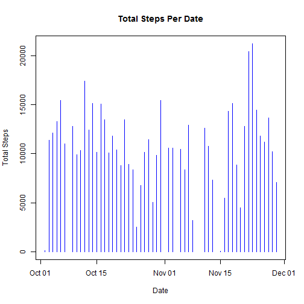
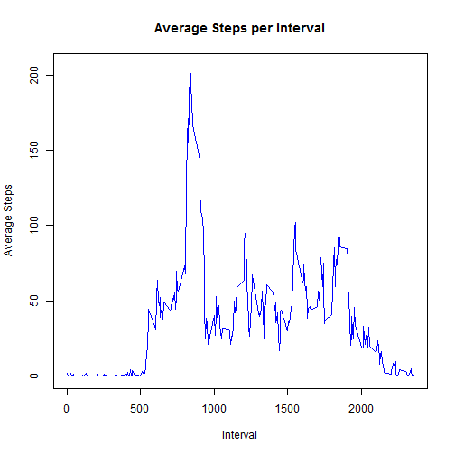
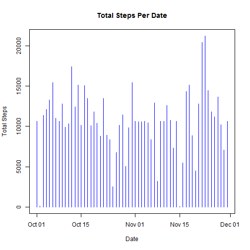
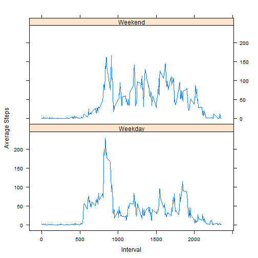

 These are the steps followed for the completion of the first Peer Assesment of the "Reproducible Research" Coursera course. 
 
 

## Loading and preprocessing the data

The data have already been downloaded in the working directory and they are loaded in R using the **read.csv()**. They are also loaded the libraries needed throughout the assesment.


```r
library(dplyr)
library(sqldf)
library(lattice)

Sys.setlocale("LC_TIME", "English")

file <- "./activity.csv"

if (!file.exists(file)){
     unzip("activity.zip", unzip = "internal") 
}

data <- read.csv(file, header=TRUE, sep=",", stringsAsFactors = FALSE)
```

## What is mean total number of steps taken per day?

In order to answer the first question i am transforming my data to create the plot of ***"Total Steps Per Date"***.


```r
q1 <- select(data[!is.na(data$steps),],steps,date) %>% 
          group_by(date) %>% 
          summarize(TotalSteps=sum(steps))

Sys.setlocale("LC_TIME", "English")

plot(as.Date(q1$date,format="%Y-%m-%d"),q1$TotalSteps,type="h",xlab="Date",ylab="Total Steps",main="Total Steps Per Date", col="blue")
```

 

The **mean** total number of steps taken per day equals to:


```r
mean(q1$TotalSteps)
```

```
## [1] 10766.19
```


The **median** total number of steps taken per day equals to:


```r
median(q1$TotalSteps)
```

```
## [1] 10765
```

## What is the average daily activity pattern?

The average activity pattern is depicted in the following plot:


```r
q2 <- select(data[!is.na(data$steps),],steps,interval) %>% 
    group_by(interval)  %>% 
    summarize(AverageSteps=mean(steps))

plot(q2,type="l",xlab="Interval",ylab="Average Steps",main="Average Steps per Interval",col="blue")
```

 


The 5-minute interval, on average across all the days in the dataset which contains the maximum number of steps is the following:


```r
q2[order(-q2$AverageSteps),][1,1]
```

```
## Source: local data frame [1 x 1]
## 
##   interval
## 1      835
```


## Imputing missing values

The number of rows with NA values in the dataset is:


```r
sum(is.na(data))
```

```
## [1] 2304
```

I create a new dataset for the purposes of this section of this Assesement with all the NA values of the steps variable replaced with the average value of steps per interval which i already have calculated from question 2.


```r
dataFilled<- sqldf("select 
                         case 
                              when data.steps is null then AverageSteps 
                              else steps 
                         end as steps,
                         data.date,
                         data.interval
                    from 
                         data 
                         inner join q2 
                         on data.interval=q2.interval")

q3 <- select(dataFilled,steps,date) %>% 
     group_by(date) %>% 
     summarize(TotalSteps=sum(steps))

plot(as.Date(q3$date,format="%Y-%m-%d"),q3$TotalSteps,type="h",xlab="Date",ylab="Total Steps",main="Total Steps Per Date",col="blue")
```

 

The **mean** total number of steps taken per day equals to:


```r
mean(q3$TotalSteps)
```

```
## [1] 10749.77
```


The **median** total number of steps taken per day equals to:


```r
median(q3$TotalSteps)
```

```
## [1] 10641
```


As we can see by filling the NA values there is a similar pattern to our plot with the one from Question 1 but the values have slightly decreased.

## Are there differences in activity patterns between weekdays and weekends?

In order to spot any differnces between the activity of weekdays and the activity of weekends i create a new *TypeOfDay*  variable and i create the weekdays/weekend activity plot.


```r
q4<-mutate(dataFilled,TypeOfDay=as.factor(ifelse(weekdays(as.Date(dataFilled$date,format="%Y-%m-%d")) %in% c("Saturday","Sunday"), "Weekend", "Weekday")) )

q4 <- sqldf("select 
                interval,
                TypeOfDay,
                Avg(steps) as AvgSteps
            from 
                q4
            group by
                interval,
                TypeOfDay")

print(xyplot(AvgSteps~interval|TypeOfDay,data=q4,type="l",layout=c(1,2),xlab="Interval", ylab="Average Steps"))
```

 

As we can see from the plot there are certain differences in the average value of every interval between weekends and weekdays and even though the average values in weekends are generally higher than the ones of the weekdays, the highest value is on the weekday part of the plot. 
